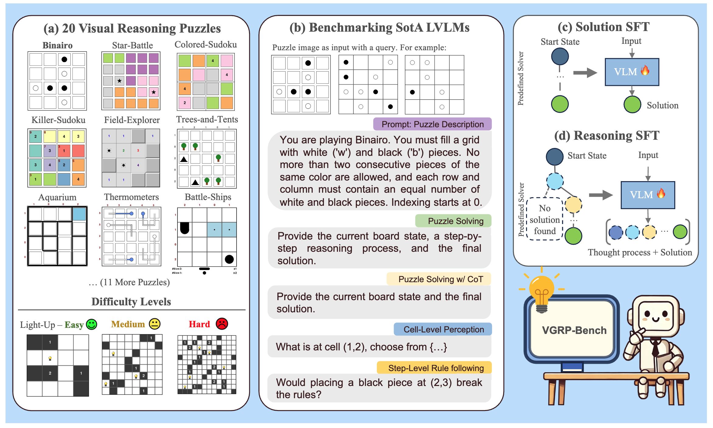

# Official Evaluation Scripts for Paper: VGRP-Bench: Visual Grid Reasoning Puzzle Benchmark for Large Vision-Language Models (Under Construction)


[](https://arxiv.org/abs/2503.23064)
[](https://yufan-ren.com/subpage/VGRP-Bench/index.html)
[](https://huggingface.co/datasets/VGRP-Bench/VGRP-Bench/tree/main)


## Introduction

Large Vision-Language Models (LVLMs) struggle with puzzles, which require precise perception, rule comprehension, and logical reasoning. Assessing and enhancing their performance in this domain is crucial, as it reflects their ability to engage in structured reasoning — an essential skill for real-world problem-solving. However, existing benchmarks primarily evaluate pre-trained models without additional training or fine-tuning, often lack a dedicated focus on reasoning, and fail to establish a systematic evaluation framework. To address these limitations, we introduce \textbf{VGRP-Bench}, a Visual Grid Reasoning Puzzle Benchmark featuring 20 diverse puzzles. VGRP-Bench spans multiple difficulty levels, and includes extensive experiments not only on existing chat LVLMs (e.g., GPT-4o), but also on reasoning LVLMs (e.g., Gemini-Thinking). Our results reveal that even the state-of-the-art LVLMs struggle with these puzzles, highlighting fundamental limitations in their puzzle-solving capabilities. Most importantly, through systematic experiments, we identify and analyze key factors influencing LVLMs’ puzzle-solving performance, including the number of clues, grid size, and rule complexity. Furthermore, we explore two Supervised Fine-Tuning (SFT) strategies that can be used in post-training: SFT on solutions (S-SFT) and SFT on synthetic reasoning processes (R-SFT). While both methods significantly improve performance on trained puzzles, they exhibit limited generalization to unseen ones. We will release VGRP-Bench to facilitate further research on LVLMs for complex, real-world problem-solving.



# How to Use this Evaluation Scripts to Evaluate a LVLM model

## Install the environment

> The following steps are tested on a 1 2-GPU node with 80GB A100. 

```bash
conda create -n vgrpb python=3.10
# or 
conda create --prefix ../../conda/vgrp python=3.10 pip

conda activate vgrpb
# or 
conda activate ../../conda/vgrp

pip install -r requirements.txt 
```

You might need to login huggingface to use some models such as Llama

```bash
huggingface-cli login
```

set a temporal directory for model downloading 
```bash
export TEMP_DIR_VGRPB=../../TEMP_DIR_VGRPB
```

# Run the evaluation

> Currently only support puzzle solving. Please refer to https://huggingface.co/datasets/VGRP-Bench/VGRP-Bench for more details regarding the dataset.

```bash
# set API keys; modify this file and run
source scripts/set_api.sh

# inference with a LVLM model
python src/inference.py --model <model_name> --subset <subset_name>

# format 
python src/formating.py --model <model_name> --subset <subset_name>

# evaluate results
python src/evaluate.py --model <model_name> --subset <subset_name>

# To run in all experiments, please refer to scripts/
```

## Evaluate with local vllm server

```bash
# start the vllm server; refer to 
./scripts/launch_vllm_server.sh
```


